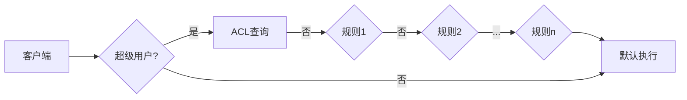

# EMQ X MySQL 8.0主题发布/订阅鉴权

[toc]

## [简介](https://docs.emqx.cn/enterprise/v4.3/advanced/acl.html)

发布订阅 ACL 指对 发布 (PUBLISH)/订阅 (SUBSCRIBE) 操作的 权限控制。EMQ X可以能过插件的形式来配置鉴权的数据源(内置数据源和外部数据库)。客户端订阅主题、发布消息时插件通过检查目标主题（Topic）是否在指定数据源允许/禁止列表内来实现对客户端的发布、订阅权限管理。

## ACL 鉴权链

当同时启用**多个 ACL 条件**时，EMQ X 将按照插件开启先后顺序进行**链式**鉴权：

- 一通过授权，终止链并允许客户端通过验证

- 一旦授权失败，终止链并禁止客户端通过验证

- 直到最后一个 ACL 插件仍未通过，根据

  默认授权

  配置判定

  - 默认授权为允许时，允许客户端通过验证
  - 默认授权为禁止时，禁止客户端通过验证


```
客户端可拥有“超级用户”身份，超级用户拥有最高权限不受 ACL 限制。
	认证鉴权插件启用超级用户功能后，发布订阅时 EMQ X 将优先检查客户端超级用户身份
	客户端为超级用户时，通过授权并跳过后续 ACL 检查
```

## 授权结果

任何一次 ACL 授权最终都会返回一个结果：

- 允许：经过检查允许客户端进行操作
- 禁止：经过检查禁止客户端操作
- 忽略（ignore）：未查找到 ACL 权限信息，无法显式判断结果是允许还是禁止，交由下一 ACL 插件或默认 ACL 规则来判断

### ACL 规则表（数据表）

在[EMQ X MySQL 8认证](https://blog.csdn.net/maker_knz/article/details/120727309?spm=1001.2014.3001.5501)基础上完成

mqtt_acl表字段说明：

- allow：禁止（0），允许（1）
- ipaddr：设置 IP 地址，如果为NULL表示匹配所有地址
- username：连接客户端的用户名，此处的值如果设置为 `$all`或NULL 表示该规则适用于所有的用户
- clientid：连接客户端的 Client ID，如果为NULL表示匹配所有clientid
- access：允许的操作：订阅（1），发布（2），订阅发布都可以（3）
- topic：控制的主题包括[系统主题](https://docs.emqx.cn/broker/v4.3/advanced/system-topic.html)，可以使用通配符，并且可以在主题中加入占位符来匹配客户端信息，例如 /topic/%c 则在匹配时主题将会替换为当前客户端的 Client ID
  - %u：用户名
  - %c：Client ID

```
CREATE TABLE `mqtt_acl` (
  `id` int(11) unsigned NOT NULL AUTO_INCREMENT,
  `allow` int(1) DEFAULT 1 COMMENT '0: deny, 1: allow',
  `ipaddr` varchar(60) DEFAULT NULL COMMENT 'IpAddress',
  `username` varchar(100) DEFAULT NULL COMMENT 'Username',
  `clientid` varchar(100) DEFAULT NULL COMMENT 'ClientId',
  `access` int(2) NOT NULL COMMENT '1: subscribe, 2: publish, 3: pubsub',
  `topic` varchar(100) NOT NULL DEFAULT '' COMMENT 'Topic Filter',
  `create_time` TIMESTAMP NOT NULL DEFAULT current_timestamp COMMENT '创建时间',
  `modified_time` TIMESTAMP NOT NULL DEFAULT current_timestamp ON UPDATE current_timestamp COMMENT '修改时间',
  PRIMARY KEY (`id`)
) ENGINE=InnoDB DEFAULT CHARSET=utf8mb4;
```

如果使用Navicat可以通过以下方式创建，创建完表可以直接ACL测试，不需要配置重启。


### 修改配置

配置和EMQ X MySQL 8 认证配置一致，可以根据业务需要增加query语句字段。

```
# etc/plugins/emqx_auth_mysql.conf
## Superuser query.
##
## Value: SQL
##
## Variables:
##  - %u: username 用户名
##  - %c: clientid 用户id
##  - %C: common name of client TLS cert  TLS证书名
##  - %d: subject of client TLS cert  TLS子证书名
##
auth.mysql.super_query = select is_superuser from mqtt_user where username = '%u' limit 1                                                                               
## ACL query.
##
## Value: SQL
##
## Variables:
##  - %a: ipaddr ip地址
##  - %u: username 用户名
##  - %c: clientid 用户id
##                                                                                       
## Note: You can add the 'ORDER BY' statement to control the rules match order
auth.mysql.acl_query = select allow, ipaddr, username, clientid, access, topic from mqtt_acl where ipaddr = '%a' or username = '%u' or username = '$all' or clientid = '
```

超级用户查询结果只能有一条，多条结果时只取第一条作为有效数据

其他用户查询结果可以有多条，多条结果时按照从上到下的顺序进行匹配

查询结果中必须包含 allow、access、topic、clientid、username、ipaddr 字段，如果字段不想参与比对则使用 `$all` 字符串或者数据库 `NULL` 值



#### 系统配置

##### ACL 缓存

ACL 缓存允许客户端在命中某条 ACL 规则后，便将其缓存至内存中，以便下次直接使用，客户端发布、订阅频率较高的情况下开启 ACL 缓存可以提高 ACL 检查性能。

在 `etc/emqx.conf` 可以配置 ACL 缓存大小与缓存时间：

```
# etc/emqx.conf

## 是否启用
enable_acl_cache = on

## 单个客户端最大缓存规则数量
acl_cache_max_size = 32

## 缓存失效时间，超时后缓存将被清除
acl_cache_ttl = 1m
```

## 测试

### 准备

创建多个用户

```
-- 创建一个超级用户
INSERT INTO `emqx`.`mqtt_user`(`id`, `username`, `password`, `salt`, `is_superuser`, `created`) VALUES (1, 'emqx', 'a053f6a9786c2eb1bf5b7278a6beab2c2409a41855cc2da68e784b853e5bbe3f', 'maker_knz', 1, NULL);
-- 创建client_1用户
INSERT INTO `emqx`.`mqtt_user`(`id`, `username`, `password`, `salt`, `is_superuser`, `created`) VALUES (2, 'client_1', 'a053f6a9786c2eb1bf5b7278a6beab2c2409a41855cc2da68e784b853e5bbe3f', 'maker_knz', 0, NULL);
-- 创建client_2用户
INSERT INTO `emqx`.`mqtt_user`(`id`, `username`, `password`, `salt`, `is_superuser`, `created`) VALUES (3, 'client_2', 'a053f6a9786c2eb1bf5b7278a6beab2c2409a41855cc2da68e784b853e5bbe3f', 'maker_knz', 0, NULL);

```

### 测试超级用户

```
-- 测试禁止超级用户
INSERT INTO `emqx`.`mqtt_acl`(`id`, `allow`, `ipaddr`, `username`, `clientid`, `access`, `topic`, `create_time`, `modified_time`) VALUES (1, 0, NULL, 'emqx', NULL, 3, '/emqx/#', '2021-10-21 14:15:36', '2021-10-21 14:15:36');
-- 禁止客户端client_2订阅/发布/emqx/下所有主题
INSERT INTO `emqx`.`mqtt_acl`(`id`, `allow`, `ipaddr`, `username`, `clientid`, `access`, `topic`, `create_time`, `modified_time`) VALUES (2, 0, NULL, 'client_1', NULL, 3, '/emqx/#', '2021-10-21 14:25:13', '2021-10-21 14:25:13');
```

超级用户可以直接订阅/发布

非超级用户不可订阅/发布


### 测试IP地址

本机IP为192.168.31.97

```
-- 禁止client_1 192.168.31.97 上的客户端发布/订阅/emqx下的所有主题
INSERT INTO `emqx`.`mqtt_acl`(`id`, `allow`, `ipaddr`, `username`, `clientid`, `access`, `topic`, `create_time`, `modified_time`) VALUES (2, 0, '192.168.31.97', 'client_1', NULL, 3, '/emqx/#', '2021-10-21 14:25:13', '2021-10-21 14:38:53');
```

使用

使用username为client_1的客户端无法发布/订阅/emqx/test主题

将allow从0修改成1后可以访问

### 测试发布/订阅

client_2的禁止/emqx/sub主题的订阅

client_2禁止/emqx/pub主题的发布

```
-- 禁止客户端client_2订阅/emqx/sub主题
INSERT INTO `emqx`.`mqtt_acl`(`id`, `allow`, `ipaddr`, `username`, `clientid`, `access`, `topic`, `create_time`, `modified_time`) VALUES (3, 0, NULL, 'client_2', NULL, 1, '/emqx/sub', '2021-10-21 14:50:02', '2021-10-21 14:50:36');
-- 禁止客户端client_2在/emqx/pub的主题上发布
INSERT INTO `emqx`.`mqtt_acl`(`id`, `allow`, `ipaddr`, `username`, `clientid`, `access`, `topic`, `create_time`, `modified_time`) VALUES (4, 0, NULL, 'client_2', NULL, 2, '/emqx/pub', '2021-10-21 14:50:34', '2021-10-21 14:50:38');
```

### 测试ACL链

```
-- 禁止client_1 上的客户端发布/订阅/emqx下的所有主题
INSERT INTO `emqx`.`mqtt_acl`(`id`, `allow`, `ipaddr`, `username`, `clientid`, `access`, `topic`, `create_time`, `modified_time`) VALUES (2, 0, NULL, 'client_1', NULL, 3, '/emqx/#', '2021-10-21 14:25:13', '2021-10-21 15:15:26');
-- 允许client_1 上的客户端发布/订阅/emqx下的所有主题
INSERT INTO `emqx`.`mqtt_acl`(`id`, `allow`, `ipaddr`, `username`, `clientid`, `access`, `topic`, `create_time`, `modified_time`) VALUES (3, 1, NULL, 'client_1', NULL, 1, '/emqx/#', '2021-10-21 14:50:02', '2021-10-21 15:15:28');

```

测试可以发布/订阅/emqx下的所有主题

```
-- 允许client_1 上的客户端发布/订阅/emqx下的所有主题
INSERT INTO `emqx`.`mqtt_acl`(`id`, `allow`, `ipaddr`, `username`, `clientid`, `access`, `topic`, `create_time`, `modified_time`) VALUES (2, 1, NULL, 'client_1', NULL, 3, '/emqx/#', '2021-10-21 14:25:13', '2021-10-21 15:15:26');
-- 禁止client_1 上的客户端发布/订阅/emqx下的所有主题
INSERT INTO `emqx`.`mqtt_acl`(`id`, `allow`, `ipaddr`, `username`, `clientid`, `access`, `topic`, `create_time`, `modified_time`) VALUES (3, 0, NULL, 'client_1', NULL, 1, '/emqx/#', '2021-10-21 14:50:02', '2021-10-21 15:15:28');
```

测试不可以发布/订阅/emqx下的所有主题

#### 结论

ACL是一个鉴权链，鉴权链中的规则从数据库中查出，查出的结果根据ID号从大到小排序，当遇到第一个满足规则的权限即可返回。

## 总结

本文是对发布订阅的ACL的介绍和使用，可以结合上一篇一起学习，它们使用同一个配置etc/plugins/emqx_auth_mysql.conf，在认证表mqtt_user中有个is_superuser可以无视mqtt_acl表中的任何规则，在应用时需要谨慎设置superuser。ACL是一个鉴权链，根据配置中的query语句可以查出一系列规则，根据规则的顺序依次执行，直到满足的规则。
